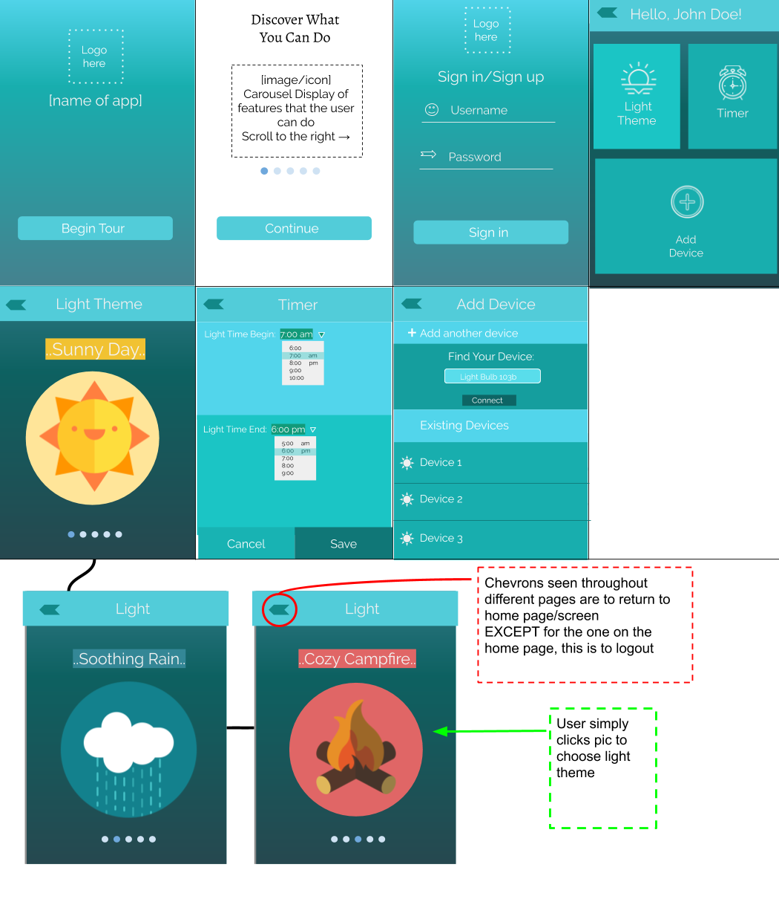

# Table of contents

* [The App](#the-app)
* [Mockup Interface](#mockup-interface)
* [Languages](#languages)

# The App

The goal of our app is to be able to configure the light to be able to change according to different light themes that represent weather or nature. 

# Mockup Interace

# Languages

The languages we are using to develop this app is Python, HTML, and CSS. To be able to connect and control our yeelight, we will be using a Python library. More about this library here: [python-yeelight](https://github.com/skorokithakis/python-yeelight)
